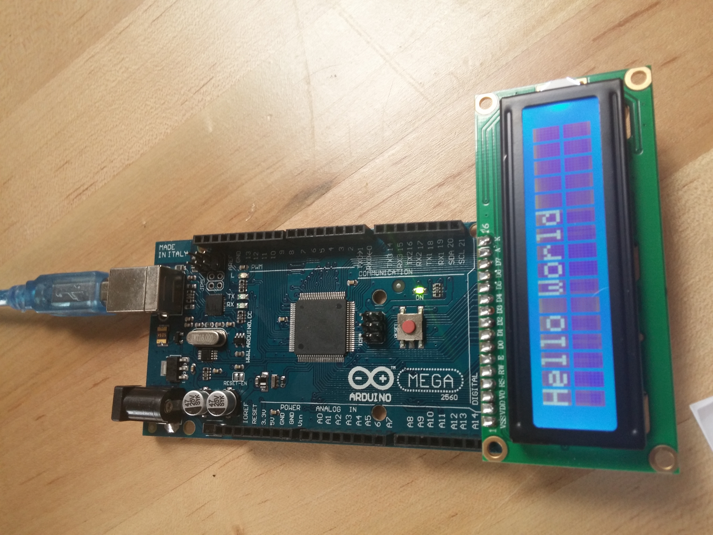
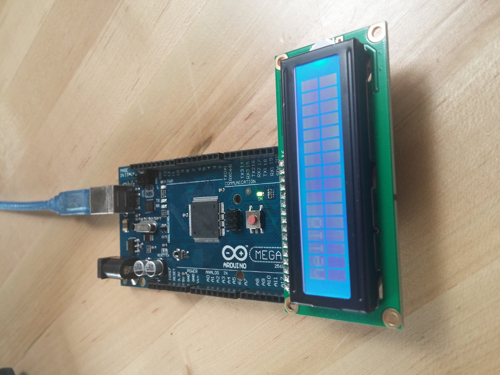
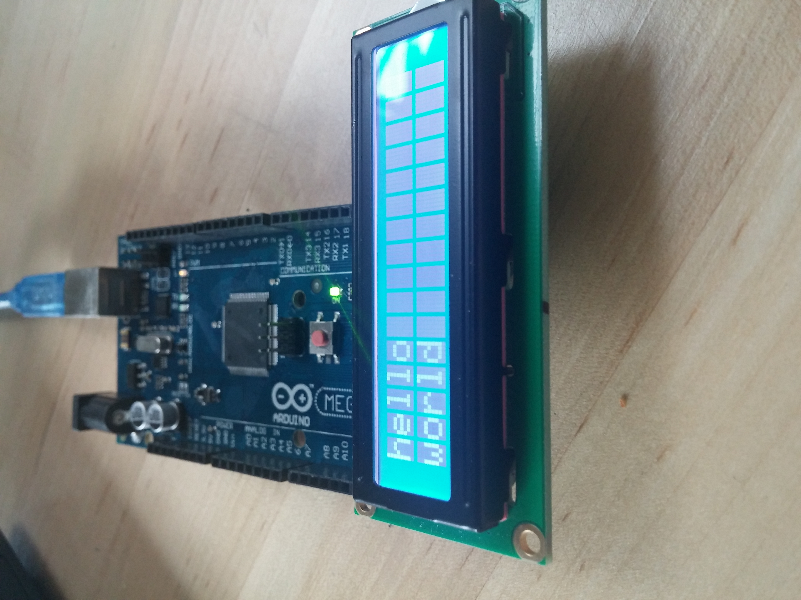
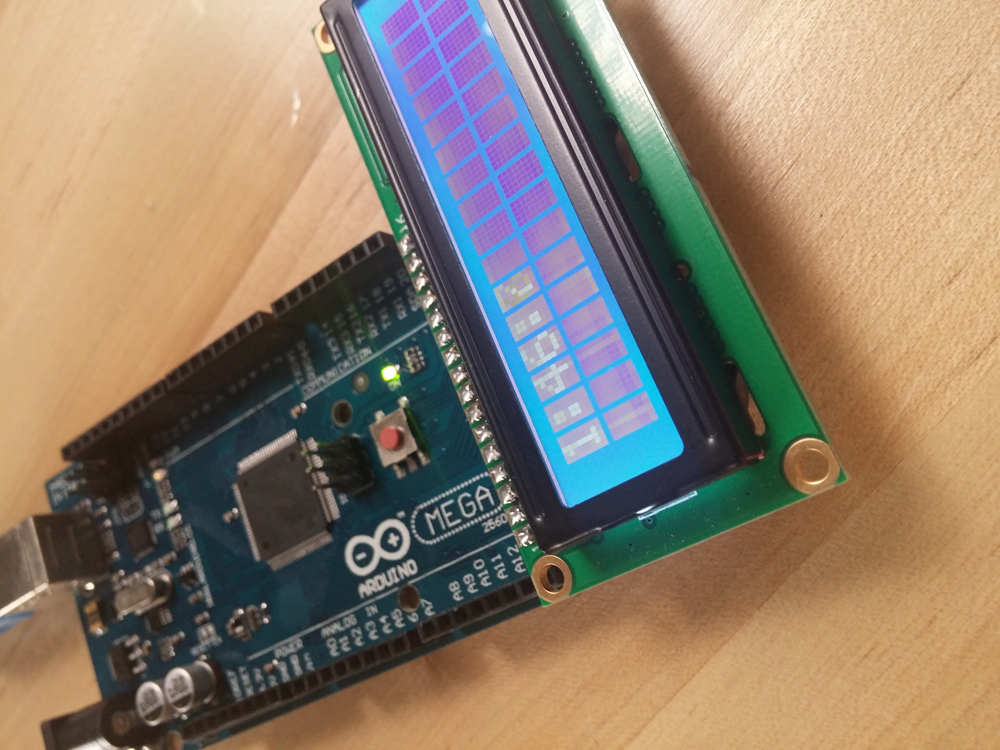

#Lab 10 

##Group : Nathan Berton, Sarah Abrahamson , Matthew Mawby

1\. We got the blinking light working and moved quickly to hello world.

2\. Our Working Hello World [Source](lab10.txt)

3\. Serial Hello World [Soruce](Lab10.txt)
	
	 Working New line
	 

4\.Forgot to take a picture [Source](lab10.ino)

5\.WorkingClock [Source](lab10part5.ino)
