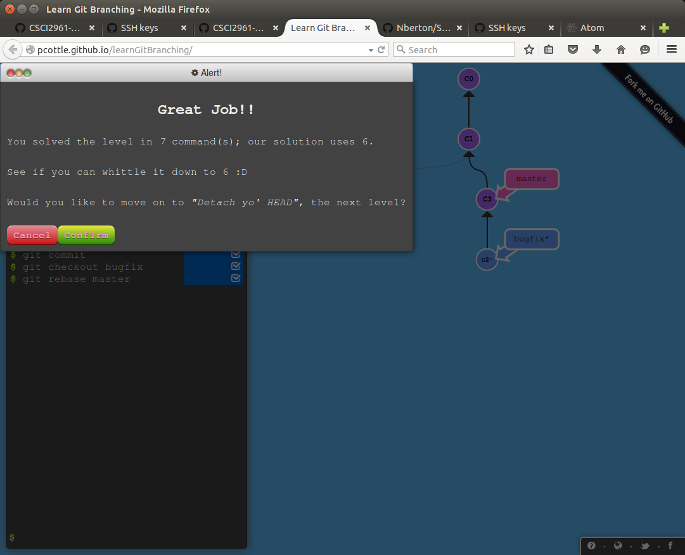

#Lab3

##Part 1

1\. Created [repository](https://github.com/Nberton/excercise01)

2\. Created Read.me

3\. Created Repository for only Lab3 README.md

All Progress for this checkpoint can bee seen in the excercise01 repository

##Part2

1\. Worked through the instructions to arrive at my forked repository linked in step 2. 

2\. [This is my Forked Repository](https://github.com/Nberton/Spoon-Knife.git)

3\. Wrote and pushed myprojectprogress.md can be found in above repo.

4\. 

##Part3

4\.[Course Project Repo](https://github.com/Nberton/courseproject)

5\. [Team Repo](https://github.com/sarahabrahamson/Story)
