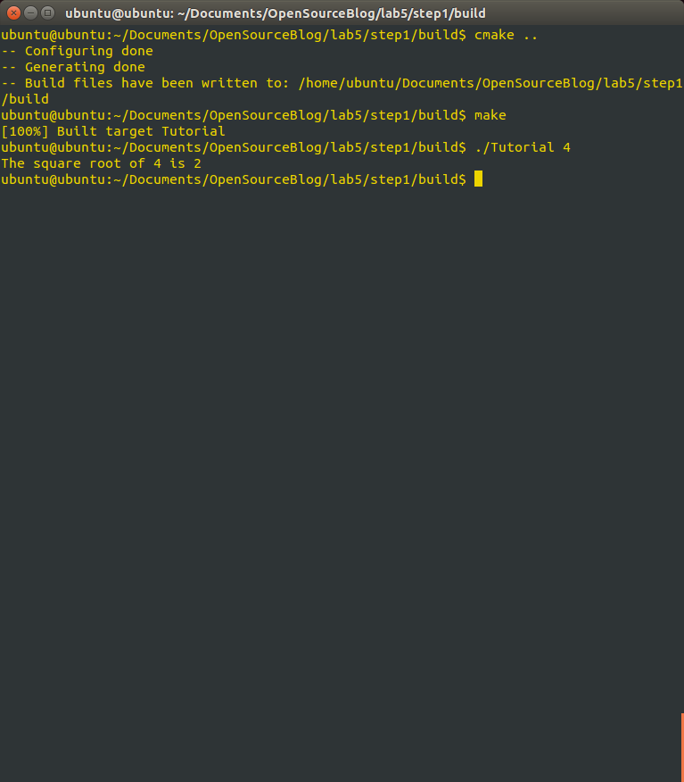
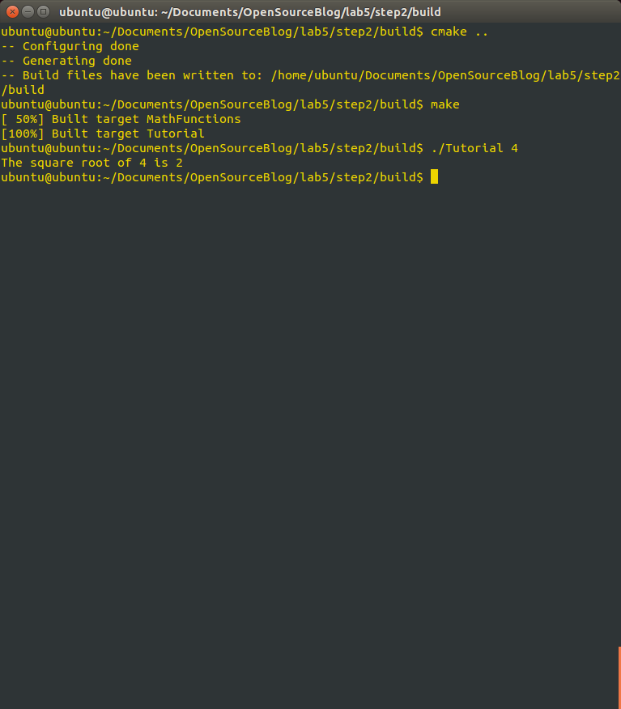
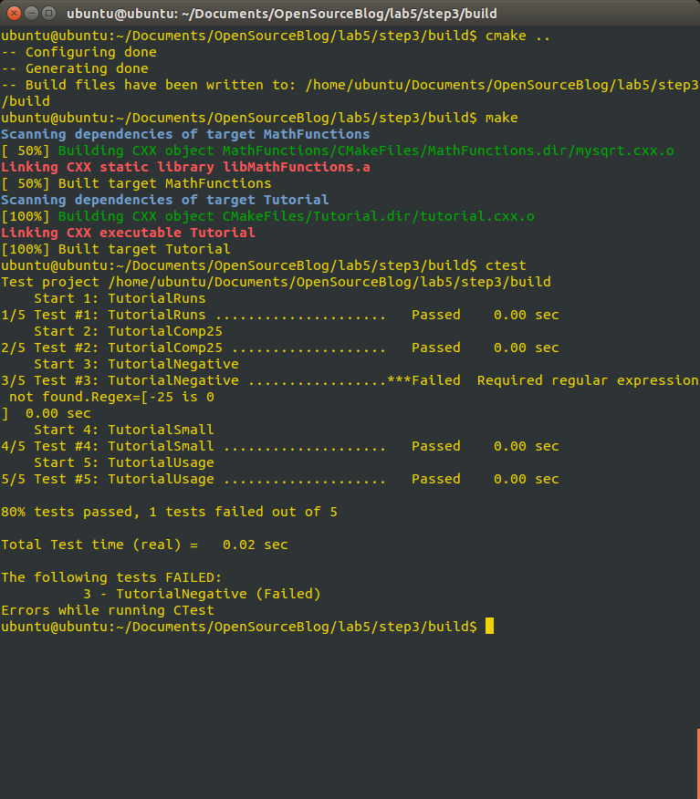
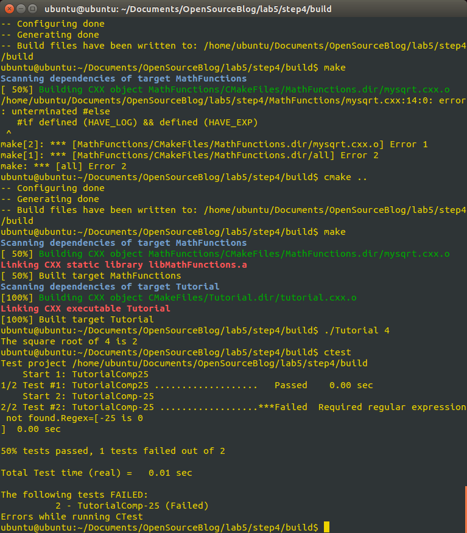
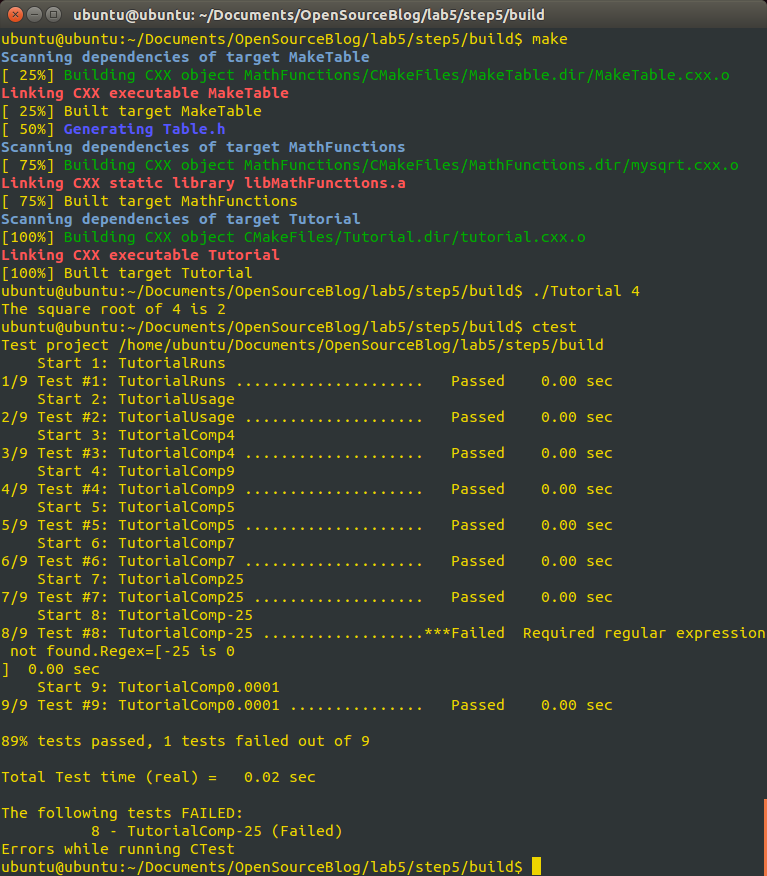

#Lab5

1\.Step 1 was all set up of the files and reading on what they individually 
do. 

Files Created in this step: cmakelists.txt, tutorial.cxx ,TuturialConfig.h

2\. Custom Sqrt function 

3\. Library + Install

4\. System Introspection 

5\. Adding a Generated FIle and Generator

All of the Source for this lab is under the lab5 folder in this repository
