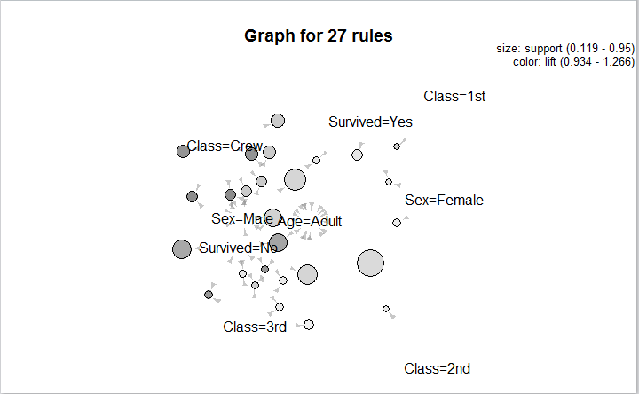
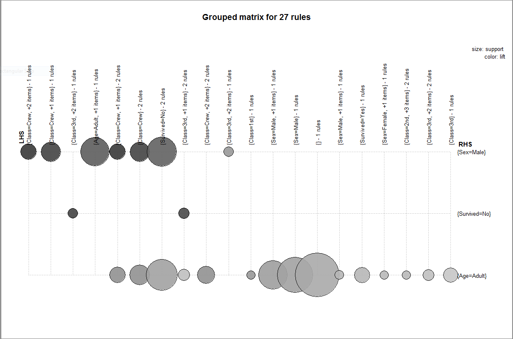
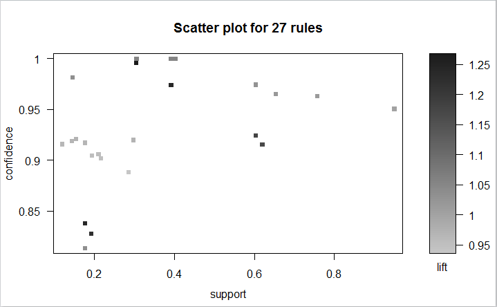

#Lab9

1\. Read the Slides

2\. and the book 

3\. Followed along in the slides and then made some graphs I kind of understand.
		
		
		

4\. I didn't seem to need the bioLite library

6\. I forked the rocketchat repository but have been busy studying for a test all week
		so not that much progress has been made in terms of coding.
